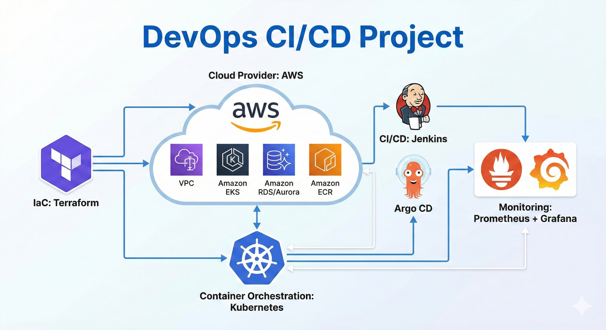
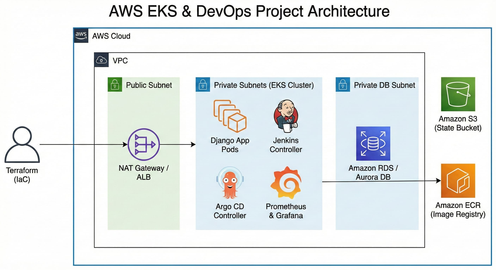
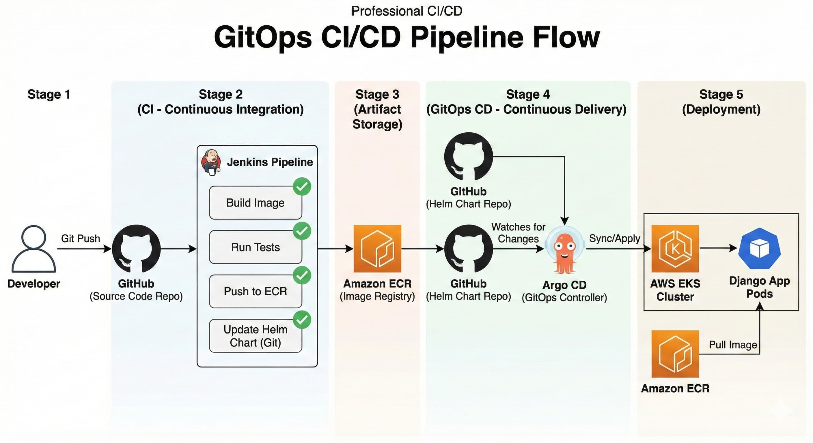

# DevOps CI/CD: Jenkins, Argo CD, EKS, Terraform, Monitoring

Цей навчальний проект реалізує повний цикл **CI/CD** (Continuous Integration / Continuous Delivery), **GitOps** підходів та **Моніторингу** для розгортання Django-застосунку в Kubernetes (AWS EKS).

Інфраструктура керується через **Terraform**, збірка та доставка артефактів — через **Jenkins**, синхронізація стану кластера — через **Argo CD**, а спостережуваність забезпечується стеком **Prometheus & Grafana**.

---

## 🚀 Зміст та Навігація (Гілки)

Клацніть на назву гілки, щоб перейти до відповідного етапу розробки:

* 🔗 [**lesson-3**](https://github.com/Maksym-Zyza/devops-ci-cd/tree/lesson-3) — Автоматизація: скрипт для встановлення Docker, Docker Compose, Python і Django.
* 🔗 [**lesson-4**](https://github.com/Maksym-Zyza/devops-ci-cd/tree/lesson-4) — Контейнеризація: Стек Django + PostgreSQL + Nginx (Dockerfile та docker-compose).
* 🔗 [**lesson-5**](https://github.com/Maksym-Zyza/devops-ci-cd/tree/lesson-5) — IaC Base: Налаштування AWS VPC, S3 Backend та ECR через Terraform.
* 🔗 [**lesson-6**](https://github.com/Maksym-Zyza/devops-ci-cd/tree/lesson-6) — Cloud K8s: Базова інфраструктура + розгортання кластера AWS EKS.
* 🔗 [**lesson-7**](https://github.com/Maksym-Zyza/devops-ci-cd/tree/lesson-7) — Helm: Створення Helm Charts для Django та робота з ConfigMap/Secrets.
* 🔗 [**lesson-8-9**](https://github.com/Maksym-Zyza/devops-ci-cd/tree/lesson-8-9) — CI/CD & GitOps: Повний цикл автоматизації з Jenkins та Argo CD.
* 🔗 [**lesson-db-module**](https://github.com/Maksym-Zyza/devops-ci-cd/tree/lesson-db-module) — Databases: Модульний підхід Terraform для розгортання RDS та Aurora DB.
* 🔗 [**final-project**](https://github.com/Maksym-Zyza/devops-ci-cd/tree/final-project) — Production Ready: Повний стек (CI/CD + GitOps + Monitoring).

---

## 🛠 Технології

Проект поєднує найактуальніші інструменти сучасного DevOps:

* **Infrastructure:** AWS (EKS, VPC, ECR, RDS, S3), Terraform.
* **CI/CD:** Jenkins (Pipelines), Argo CD (GitOps).
* **Orchestration:** Kubernetes, Helm.
* **Monitoring:** Prometheus, Grafana.
* **Backend:** Django, Python, Nginx, PostgreSQL.
* **OS/Tools:** Linux, Docker, Git.

---

## 🎯 Для кого цей проект

1.  **Для початківців у DevOps:** проект дає розуміння того, як окремі інструменти (Terraform, Jenkins, K8s) збираються в єдину систему.
2.  **Для системних адміністраторів:** перехід від ручного керування серверами до Infrastructure as Code.
3.  **Для розробників (Backend/Frontend):** розуміння життєвого циклу застосунку після натискання кнопки "push".

---

## 📚 Основні терміни й концепції

> **Короткий глосарій проекту:**

* **DevOps** — автоматизація взаємодії розробки та експлуатації.
* **Infrastructure as Code (IaC)** — керування залізом за допомогою коду (Terraform).
* **GitOps** — використання Git як єдиного джерела правди для стану системи (Argo CD).
* **Continuous Integration (CI)** — автоматична збірка та тестування коду.
* **Continuous Delivery (CD)** — автоматична доставка готового коду в середовище.
* **Jenkins** — головний сервер автоматизації (оркестратор пайплайнів).
* **Kubernetes** — платформа для керування контейнерами.
* **Aurora DB** — хмарна база даних AWS з високою доступністю.
* **DevSecOps** — інтеграція безпеки на кожному етапі розробки.

## Architecture Diagram

## CI/CD Workflow
