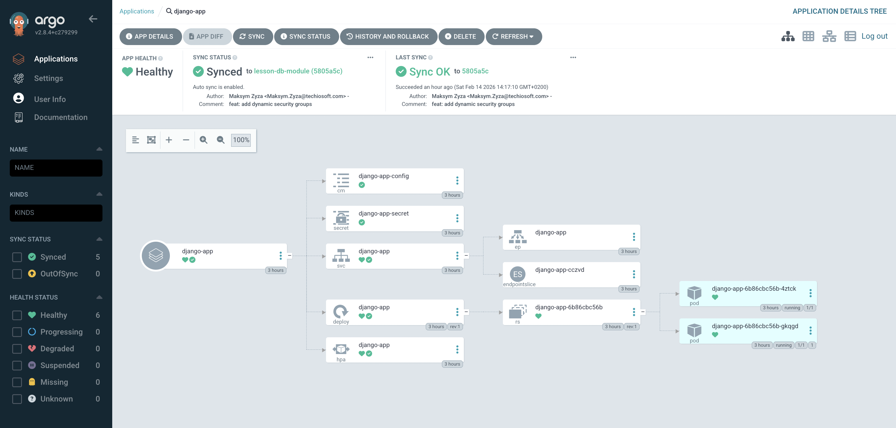
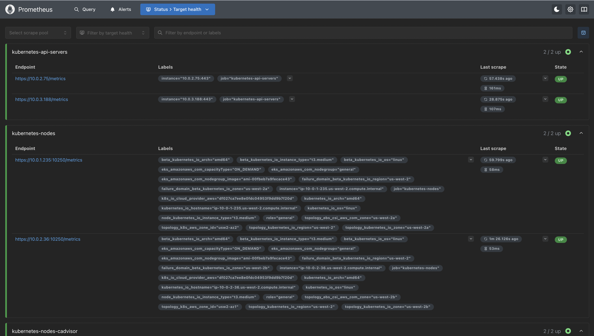
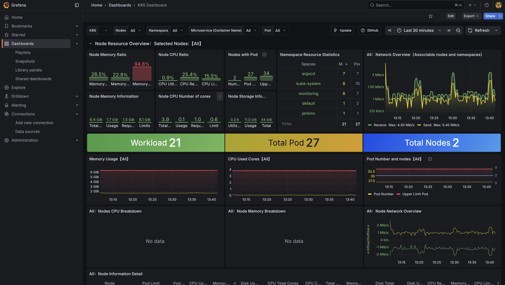

# DevOps CI/CD Final Project

## Опис проєкту

Цей проєкт реалізує повний цикл DevOps інфраструктури на AWS з використанням Terraform.
Він включає розгортання мережі (VPC), Kubernetes кластера (EKS), баз даних (RDS/Aurora), а також налаштування CI/CD процесів (Jenkins, Argo CD) та моніторингу (Prometheus, Grafana).

---

## Архітектура та Компоненти

*   **IaC:** Terraform
*   **Cloud Provider:** AWS
*   **Network:** VPC (Public/Private Subnets, NAT Gateway)
*   **Container Orchestration:** Amazon EKS
*   **Database:** Amazon RDS (PostgreSQL) або Amazon Aurora (конфігурується)
*   **Container Registry:** Amazon ECR
*   **CI/CD:** Jenkins + Argo CD
*   **Monitoring:** Prometheus + Grafana (kube-prometheus-stack)

---

## Структура проєкту

```bash
final-project/
├── main.tf                  # Головний файл (підключення модулів)
├── variables.tf             # Вхідні змінні
├── outputs.tf               # Виводи (endpoints, credentials)
├── modules/                 # Локальні Terraform модулі
│   ├── vpc/                 # Мережа
│   ├── eks/                 # Кластер Kubernetes
│   ├── rds/                 # База даних
│   ├── ecr/                 # Реєстр контейнерів
│   ├── jenkins/             # Jenkins (Helm)
│   ├── argo_cd/             # Argo CD (Helm)
│   └── monitoring/          # Prometheus & Grafana (Helm)
└── README.md                # Документація
```

---

## 🚀 Quick Start (Інструкція з запуску)

### 1. Підготовка (Prerequisites)
Переконайтеся, що у вас встановлені:
*   Terraform
*   AWS CLI (налаштований профіль)
*   Kubectl
*   Helm

### 2. Розгортання інфраструктури

Ініціалізація та застосування Terraform конфігурації:

```bash
cd final-project
terraform init
terraform apply
```

### 3. Перевірка доступності та Підключення

Після успішного розгортання виконайте наступні команди для доступу до сервісів.

#### 🔹 Jenkins
*   **URL:** `http://localhost:8080`
*   **Команда доступу:**
    ```bash
    kubectl port-forward svc/jenkins 8080:8080 -n jenkins
    ```
*   **Логін:** `admin`
*   **Пароль:** Виводиться в логах Jenkins при першому запуску або:
    ```bash
    kubectl get secret -n jenkins jenkins -o jsonpath="{.data.jenkins-admin-password}" | base64 --decode
    ```

#### 🔹 Argo CD
*   **URL:** `https://localhost:8081`
*   **Команда доступу:**
    ```bash
    kubectl port-forward svc/argo-cd-argocd-server 8081:443 -n argocd
    ```
    *(Прийміть ризик безпеки в браузері, оскільки сертифікат самопідписаний)*
*   **Логін:** `admin`
*   **Пароль (отримати командою):**
    ```bash
    kubectl get secret argocd-initial-admin-secret -n argocd -o jsonpath="{.data.password}" | base64 --decode
    ```

#### 🔹 Моніторинг (Grafana)
*   **URL:** `http://localhost:3000`
*   **Команда доступу:**
    ```bash
    kubectl port-forward svc/prometheus-stack-grafana 3000:80 -n monitoring
    ```
*   **Логін:** `admin`
*   **Пароль (отримати командою):**
    ```bash
    kubectl get secret -n monitoring prometheus-stack-grafana -o jsonpath='{.data.admin-password}' | base64 --decode
    ```

#### 🔹 Prometheus (UI)
*   **URL:** `http://localhost:9090`
*   **Команда доступу:**
    ```bash
    kubectl port-forward svc/prometheus-stack-kube-prom-prometheus 9090:9090 -n monitoring
    ```

---

#### 📊 Результат:
- Jenkins: Переконайтеся, що остання збірка django-docker позначена зеленим кольором.


- Argo CD: У дашборд Argo CD django-app у статусі Synced - зміни з Git автоматично розгорнуті в кластері.


- Prometheus (UI):
    

- Grafana (Monitoring):
    


Додаток: Перевірте роботу Django за посиланням балансувальника: 
```bash
# Отримати URL балансувальника
kubectl get svc django-app -n default

# Перевірити Health Check (додайте /health/ до EXTERNAL-IP)
# Приклад: http://<EXTERNAL-IP>/health/
```

## 🧹 Clean Up (Видалення ресурсів)

⚠️ **УВАГА!** Щоб уникнути зайвих витрат, після завершення роботи обов'язково видаліть створені ресурси.

1.  Видаліть інфраструктуру:
    ```bash
    terraform destroy
    ```

2.  Перевірте консоль AWS, щоб переконатися, що всі Load Balancer та EBS томи були видалені.