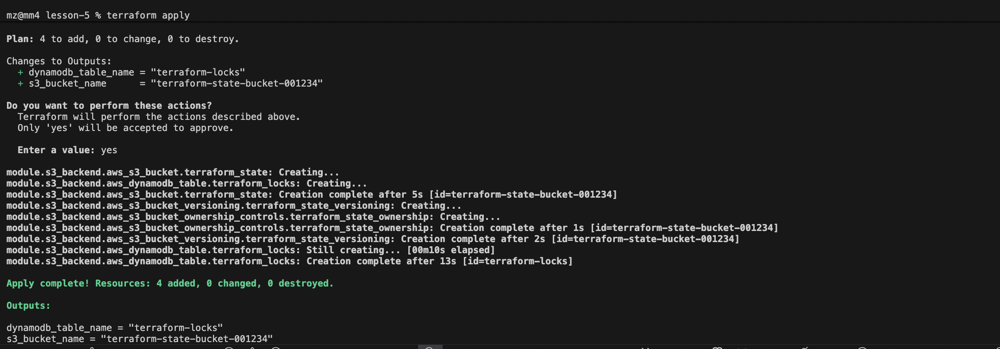

# devops-ci-cd

#### Опис структури проєкту.

```bash
lesson-5/
│
├── main.tf                  # Головний файл для підключення модулів
├── backend.tf               # Налаштування бекенду для стейтів (S3 + DynamoDB)
├── outputs.tf               # Загальне виведення ресурсів
│
├── modules/                 # Каталог з усіма модулями
│   │
│   ├── s3-backend/          # Модуль для S3 та DynamoDB
│   │   ├── s3.tf            # Створення S3-бакета
│   │   ├── dynamodb.tf      # Створення DynamoDB
│   │   ├── variables.tf     # Змінні для S3
│   │   └── outputs.tf       # Виведення інформації про S3 та DynamoDB
│   │
│   ├── vpc/                 # Модуль для VPC
│   │   ├── vpc.tf           # Створення VPC, підмереж, Internet Gateway
│   │   ├── routes.tf        # Налаштування маршрутизації
│   │   ├── variables.tf     # Змінні для VPC
│   │   └── outputs.tf       # Виведення інформації про VPC
│   │
│   └── ecr/                 # Модуль для ECR
│       ├── ecr.tf           # Створення ECR репозиторію
│       ├── variables.tf     # Змінні для ECR
│       └── outputs.tf       # Виведення URL репозиторію ECR
│
└── README.md                # Документація проєкту

```

#### Команди для ініціалізації та запуску:
```bash
terraform init
terraform plan
terraform apply
terraform destroy
```


#### Пояснення кожного модуля: s3-backend, vpc, ecr.


