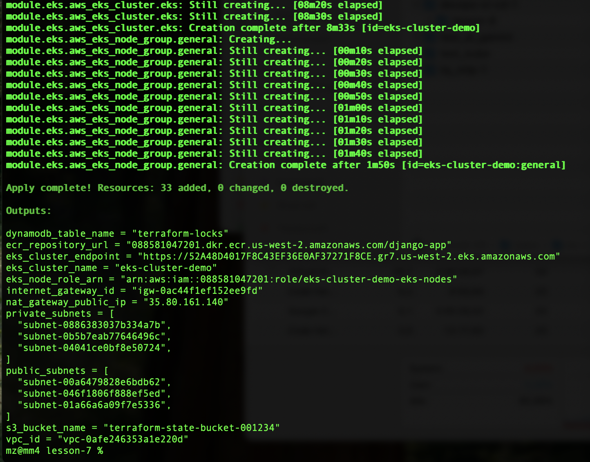
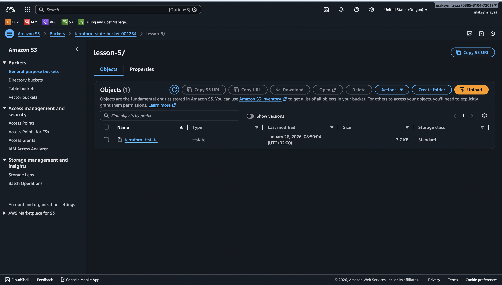

# devops-ci-cd

## Lesson 5: AWS Infrastructure with Terraform Modules

Цей проєкт розгортає базову інфраструктуру на AWS, використовуючи модульний підхід у Terraform. Проєкт включає налаштування віддаленого зберігання стану (S3 Backend), мережеву інфраструктуру (VPC) та реєстр контейнерів (ECR).

### Опис структури проєкту.

```bash
lesson-5/
│
├── main.tf                  # Головний файл для підключення модулів
├── backend.tf               # Налаштування бекенду для стейтів (S3 + DynamoDB)
├── outputs.tf               # Загальне виведення ресурсів
│
├── modules/                 # Каталог з усіма модулями
│   │
│   ├── s3-backend/          # Модуль для S3 та DynamoDB
│   │   ├── s3.tf            # Створення S3-бакета
│   │   ├── dynamodb.tf      # Створення DynamoDB
│   │   ├── variables.tf     # Змінні для S3
│   │   └── outputs.tf       # Виведення інформації про S3 та DynamoDB
│   │
│   ├── vpc/                 # Модуль для VPC
│   │   ├── vpc.tf           # Створення VPC, підмереж, Internet Gateway
│   │   ├── routes.tf        # Налаштування маршрутизації
│   │   ├── variables.tf     # Змінні для VPC
│   │   └── outputs.tf       # Виведення інформації про VPC
│   │
│   ├── ecr/                 # Модуль для ECR
│   │   ├── ecr.tf           # Створення ECR репозиторію
│   │   ├── variables.tf     # Змінні для ECR
│   │   └── outputs.tf       # Виведення URL репозиторію ECR
│   └── eks/                 # Модуль для EKS
│       ├── eks.tf           # Створення EKS-кластера та воркерів
│       ├── variables.tf     # Змінні для EKS
│       ├── outputs.tf       # Виведення інформації про EKS
│       └── node.tf          # IAM-ролі для EKS
│
└── README.md                # Документація проєкту

```

### Опис модулів

#### 1. modules/s3-backend
Цей модуль створює фундамент для командної роботи з Terraform:
- AWS S3 Bucket: Використовується для зберігання файлу стану (terraform.tfstate). Увімкнено версіювання для відновлення попередніх станів.
- AWS DynamoDB Table: Використовується для механізму блокування (State Locking), щоб запобігти одночасним змінам інфраструктури різними користувачами.

#### 2. modules/vpc
Модуль розгортає віртуальну приватну хмару (VPC):
- VPC: Ізольована мережа з власним CIDR блоком.
- Subnets: Створює публічні та приватні підмережі у різних зонах доступності (Availability Zones) для високої відмовостійкості.
- Internet Gateway: Забезпечує доступ до інтернету для ресурсів у публічних підмережах.
- Route Tables: Налаштовує правила маршрутизації трафіку.

#### 3. modules/ecr
Модуль для управління Docker-образами:
- ECR Repository: Приватний реєстр для зберігання образів контейнерів.
- Image Scanning: Увімкнено автоматичне сканування образів на вразливості при завантаженні (push).

#### 4. modules/eks
Модуль для створення EKS кластера з робочими нодами.
- EKS Cluster: Створює кластер Kubernetes у вказаних підмережах.
- Worker Nodes: Автоматично створює групу EC2 інстансів для роботи під керуванням EKS.
- IAM Roles: Генерує необхідні ролі для робочих нодів та підключення до кластеру.
- VPC Integration: Інтеграція з VPC та підмережами (public / private).
- Autoscaling: Підтримка автоматичного масштабування робочих нодів через desired_size, min_size, max_size.
- Outputs: Дозволяє отримати endpoint кластера, назву та ARN ролі нодів.
  
#### 🛠 Як запустити проєкт
Попередні вимоги
Встановлений Terraform

Встановлений AWS CLI та налаштований доступ (aws configure)

### Інструкція з розгортання
1. Ініціалізація Terraform Завантажує провайдери та ініціалізує модулі/бекенд.

```Bash
terraform init
```
(Примітка: Якщо ви запускаєте проєкт вперше і бакет для стейту ще не існує, закоментуйте блок backend "s3" у файлі backend.tf, виконайте apply, а потім розкоментуйте і виконайте terraform init -reconfigure).

2. Перевірка плану Створює план виконання, показуючи ресурси, які будуть створені.

```Bash
terraform plan
```

3. Застосування змін Розгортає інфраструктуру в AWS.
```Bash
terraform apply
```
Підтвердьте дію, ввівши yes.

4. Знищення ресурсів Якщо інфраструктура більше не потрібна, видаліть ресурси, щоб уникнути витрат.
```Bash
terraform destroy
```

### ⚙️ Вхідні дані (Variables)
Основні параметри налаштовуються у файлі main.tf при виклику модулів:
- vpc_cidr_block: CIDR блок для VPC.
- public_subnets: Список ID публічних підмереж.
- private_subnets: Список ID приватних підмереж.
- bucket_name: Унікальне ім'я для S3 бакета.
- repository_name: Ім'я репозиторію.
- cluster_name: Назва EKS кластера.
- subnet_ids: ID підмереж для EKS нодів.
- instance_type: Тип EC2 інстансів для робочих нодів.
- desired_size: Бажана кількість нодів у групі.
- max_size: Максимальна кількість нодів.
- min_size: Мінімальна кількість нодів.


#### Створені AWS ресурси

###### Розгортання інфраструктури в AWS


###### AWS S3 Backet


###### AWS VPC


###### AWS ECR


