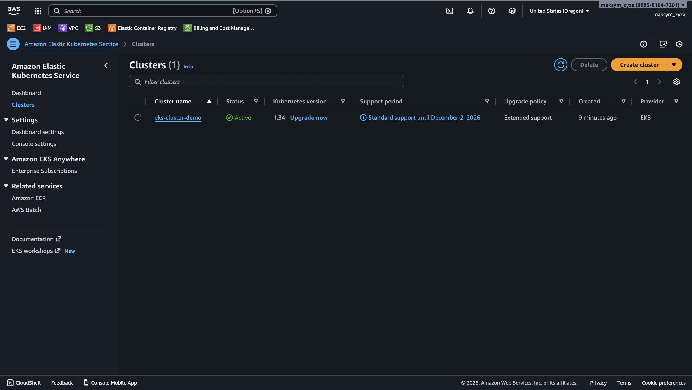
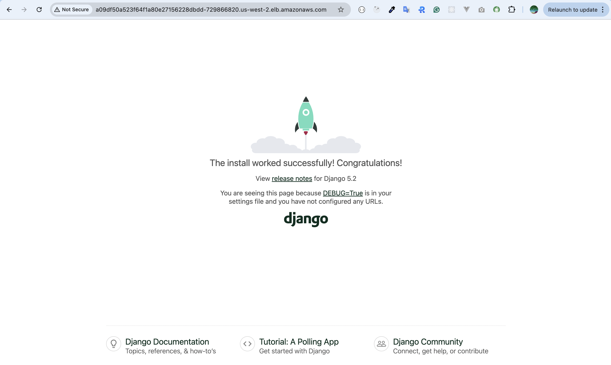

# Lesson 8-9: Jenkins CI/CD, EKS, ECR, and Helm with Terraform

Цей проєкт розгортає Kubernetes кластер на AWS за допомогою Terraform, налаштовує Elastic Container Registry (ECR), розгортає Django-застосунок через Helm, а також встановлює Jenkins для автоматизації CI/CD процесів.

### Завдання

1.  **Створення кластера Kubernetes через Terraform.**
2.  **Налаштування Elastic Container Registry (ECR)** для зберігання Docker-образу вашого Django-застосунку.
3.  **Завантаження Docker-образу Django до ECR.**
4.  **Створення Helm Chart** (deployment.yaml, service.yaml, hpa.yaml, configmap.yaml).
5.  **Перенесення змінних середовища (env)** з теми 4 в ConfigMap, який буде використаний вашим застосунком.

### Структура проєкту

```bash
lesson-8-9/
│
├── main.tf                  # Головний файл для підключення модулів
├── backend.tf               # Налаштування бекенду для стейтів (S3 + DynamoDB)
├── outputs.tf               # Загальні виводи ресурсів
│
├── modules/                 # Каталог з усіма модулями
│   ├── s3-backend/          # Модуль для S3 та DynamoDB
│   │   ├── s3.tf            # Створення S3-бакета
│   │   ├── dynamodb.tf      # Створення DynamoDB
│   │   ├── variables.tf     # Змінні для S3
│   │   └── outputs.tf       # Виведення інформації про S3 та DynamoDB
│   │
│   ├── vpc/                 # Модуль для VPC
│   │   ├── vpc.tf           # Створення VPC, підмереж, Internet Gateway
│   │   ├── routes.tf        # Налаштування маршрутизації
│   │   ├── variables.tf     # Змінні для VPC
│   │   └── outputs.tf       # Виведення інформації про VPC
│   ├── ecr/                 # Модуль для ECR
│   │   ├── ecr.tf           # Створення ECR репозиторію
│   │   ├── variables.tf     # Змінні для ECR
│   │   └── outputs.tf       # Виведення URL репозиторію
│   │
│   ├── eks/                 # Модуль для Kubernetes кластера
│   │   ├── eks.tf           # Створення кластера
│   │   ├── node.tf          # Створення нод-групи
│   │   ├── aws_ebs_csi_driver.tf # ✅ Встановлення плагіна EBS CSI
│   │   ├── variables.tf     # Змінні для EKS
│   │   └── outputs.tf       # Виведення інформації про кластер
│   │
│   └── jenkins/             # ✅ Новий модуль для Jenkins
│       ├── jenkins.tf       # Helm release для Jenkins
│       ├── variables.tf     # Змінні
│       ├── values.yaml      # Конфігурація Jenkins
│       └── outputs.tf       # Виводи
│
├── charts/
│   └── django-app/
│       ├── templates/
│       │   ├── configmap.yaml
│       │   ├── deployment.yaml
│       │   ├── hpa.yaml
│       │   └── service.yaml
│       ├── Chart.yaml
│       └── values.yaml
```

### Опис модулів

#### 1. `modules/s3-backend`
Цей модуль створює фундамент для командної роботи з Terraform:
- AWS S3 Bucket: Використовується для зберігання файлу стану (terraform.tfstate). Увімкнено версіювання для відновлення попередніх станів.
- AWS DynamoDB Table: Використовується для механізму блокування (State Locking), щоб запобігти одночасним змінам інфраструктури різними користувачами.

#### 2. `modules/vpc`
Модуль розгортає віртуальну приватну хмару (VPC):
- VPC: Ізольована мережа з власним CIDR блоком.
- Subnets: Створює публічні та приватні підмережі у різних зонах доступності (Availability Zones) для високої відмовостійкості.
- Internet Gateway: Забезпечує доступ до інтернету для ресурсів у публічних підмережах.
- Route Tables: Налаштовує правила маршрутизації трафіку.

#### 3. `modules/ecr`
Модуль для управління Docker-образами:
- ECR Repository: Приватний реєстр для зберігання образів контейнерів.
- Image Scanning: Увімкнено автоматичне сканування образів на вразливості при завантаженні (push).

#### 4. `modules/eks`
Модуль для створення EKS кластера з робочими нодами.
- EKS Cluster: Створює кластер Kubernetes у вказаних підмережах.
- Worker Nodes: Автоматично створює групу EC2 інстансів для роботи під керуванням EKS.
- IAM Roles: Генерує необхідні ролі для робочих нодів та підключення до кластеру.
- VPC Integration: Інтеграція з VPC та підмережами (public / private).
- Autoscaling: Підтримка автоматичного масштабування робочих нодів через desired_size, min_size, max_size.
- Outputs: Дозволяє отримати endpoint кластера, назву та ARN ролі нодів.

Додатково, цей модуль тепер автоматично встановлює **AWS EBS CSI Driver**. Це дозволяє Kubernetes динамічно створювати `PersistentVolume` на базі AWS EBS, що необхідно для роботи stateful-додатків, таких як Jenkins.

#### 5. `modules/jenkins`
Цей модуль розгортає Jenkins у Kubernetes кластер за допомогою офіційного Helm-чарту.
- **Helm Release:** Автоматично встановлює Jenkins в окремий неймспейс `jenkins`.
- **Persistent Storage:** Створює `PersistentVolumeClaim` для збереження даних Jenkins (завдань, плагінів, конфігурацій) між перезапусками.
- **LoadBalancer Service:** Забезпечує зовнішній доступ до Jenkins через публічну IP-адресу.
- **Pre-installed Plugins:** Включає набір ключових плагінів для CI/CD, таких як `kubernetes`, `git`, `github`, `workflow-aggregator`.

#### 🛠 Як запустити проєкт
**Попередні вимоги**
- Встановлений Terraform
- Встановлений AWS CLI та налаштований доступ (aws configure)
- Встановлений `kubectl`
- Встановлений `helm`

### Інструкція з розгортання інфраструктури
1.  **Ініціалізація Terraform** Завантажує провайдери та ініціалізує модулі/бекенд.

    ```bash
    terraform init
    ```
    (Примітка: Якщо ви запускаєте проєкт вперше і бакет для стейту ще не існує, закоментуйте блок `backend "s3"` у файлі `backend.tf`, виконайте `apply`, а потім розкоментуйте і виконайте `terraform init -reconfigure`).

2.  **Перевірка плану** Створює план виконання, показуючи ресурси, які будуть створені.

    ```bash
    terraform plan
    ```

3.  **Застосування змін** Розгортає інфраструктуру в AWS.
    ```bash
    terraform apply
    ```
    Підтвердьте дію, ввівши `yes`.

### Детальні кроки розгортання застосунку

Після того, як інфраструктура створена за допомогою Terraform, виконайте наступні кроки для розгортання вашого Django-застосунку.

### 4. Доступ до Jenkins

Після виконання `terraform apply` Jenkins буде автоматично встановлений у кластер.

**a. Отримання URL для доступу:**

Jenkins розгортається з сервісом типу `LoadBalancer`. Щоб отримати його зовнішню IP-адресу або DNS-ім'я, виконайте команду:

```bash
kubectl get svc jenkins -n jenkins
```
Знайдіть значення у колонці `EXTERNAL-IP`. Доступ до Jenkins буде за адресою `http://<EXTERNAL-IP>`.

**b. Дані для входу:**

Згідно з конфігураційним файлом `values.yaml`, початкові дані для входу:
- **Username:** `admin`
- **Password:** `admin123`

❗️ **Важливо:** Це стандартний пароль для демонстрації. Потрібно змінити його після першого входу.

#### 1. Підключення до EKS кластера
Налаштуйте `kubectl` для взаємодії з вашим новим EKS кластером.

```bash
aws eks update-kubeconfig --region us-west-2 --name eks-cluster-demo
```

Перевірте підключення:
```bash
kubectl get nodes
```

#### 2. Завантаження Docker-образу в ECR
Ці команди потрібно виконувати з директорії вашого Django-проєкту, де знаходиться `Dockerfile`.

a. **Автентифікація Docker у ECR:**
```bash
aws ecr get-login-password --region us-west-2 | docker login --username AWS --password-stdin 088581047201.dkr.ecr.us-west-2.amazonaws.com
```

b. **Build Docker-образу:**
```bash
docker build --no-cache --platform=linux/amd64 -t 088581047201.dkr.ecr.us-west-2.amazonaws.com/django-app:latest .
```

c. **Тегування образу:**
```bash
docker tag django-app:latest 088581047201.dkr.ecr.us-west-2.amazonaws.com/django-app:latest
```

d. **Push образу в ECR:**
```bash
docker push 088581047201.dkr.ecr.us-west-2.amazonaws.com/django-app:latest
```

#### 3. Розгортання застосунку за допомогою Helm
a. **Оновіть `values.yaml`:**
Перед розгортанням, відкрийте файл `lesson-7/charts/django-app/values.yaml` та переконайтесь, що вказано правильний репозиторій та тег для вашого образу:

```yaml
image:
  repository: 088581047201.dkr.ecr.us-west-2.amazonaws.com/django-app
  tag: latest
```

b. **Встановлення або оновлення Helm-релізу:**
Ця команда встановить чарт, якщо його ще немає, або оновить існуючий.
```bash
helm upgrade --install django-app ./charts/django-app --namespace django --create-namespace
```

#### 4. Знищення інфраструктури
Якщо інфраструктура більше не потрібна, видаліть ресурси, щоб уникнути витрат.
```bash
terraform destroy
```

### ⚙️ Вхідні дані (Variables)
Основні параметри налаштовуються у файлі `main.tf` при виклику модулів:
- `vpc_cidr_block`: CIDR блок для VPC.
- `public_subnets`: Список ID публічних підмереж.
- `private_subnets`: Список ID приватних підмереж.
- `bucket_name`: Унікальне ім'я для S3 бакета.
- `repository_name`: Ім'я репозиторію.
- `cluster_name`: Назва EKS кластера.
- `subnet_ids`: ID підмереж для EKS нодів.
- `instance_type`: Тип EC2 інстансів для робочих нодів.
- `desired_size`: Бажана кількість нодів у групі.
- `max_size`: Максимальна кількість нодів.
- `min_size`: Мінімальна кількість нодів.


#### Створені AWS ресурси

###### Розгортання інфраструктури в AWS


###### AWS S3 Backet


###### AWS VPC


###### AWS ECR


### Результати виконання:
1. У вашому AWS-акаунті створено кластер Kubernetes.


2. ECR містить завантажений Docker-образ Django-застосунку.


3. Застосунок розгорнутий у кластері за допомогою Helm-чарта.
  

4. Service забезпечує доступ до застосунку через публічну IP-адресу.
```bash
kubectl get pods -n django -w 
```


- Get services:
```bash
kubectl get svc -n django
```


- Port-forward:
```bash
kubectl port-forward -n django service/django-app 8080:80
```

5. ConfigMap підключено до застосунку через Helm.
    Вивести всі змінні середовища поду:
```bash
kubectl exec -n django django-app-cd9bccdd4-lc6k7 -- printenv
```


6. HPA динамічно масштабує кількість подів.

- Встановлення Metrics Server:
```bash
kubectl apply -f https://github.com/kubernetes-sigs/metrics-server/releases/latest/download/components.yaml
```

- Перевірка HPA:
```bash
kubectl get hpa -n django
```
