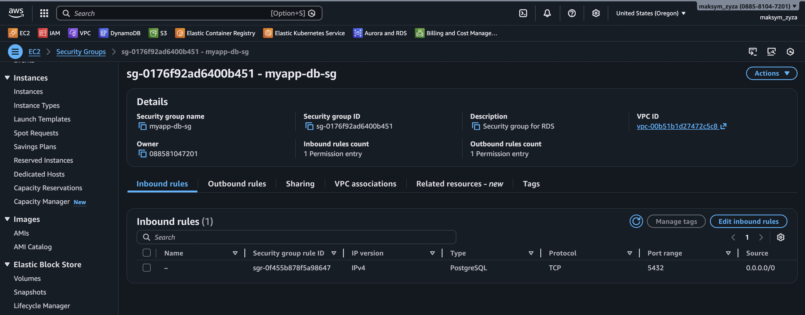
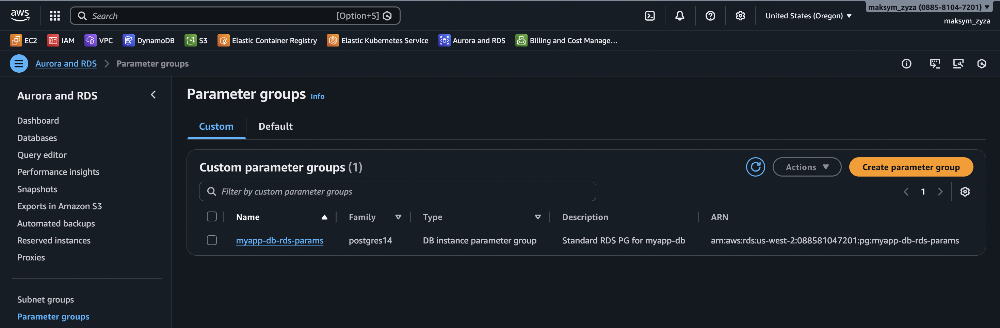

# Завдання: Універсальний модуль RDS

## Опис завдання

Реалізувати універсальний модуль `rds`, який:

1.  Підіймає **Aurora Cluster** або звичайну **RDS instance** на основі значення змінної `use_aurora`.
2.  Автоматично створює:
    *   DB Subnet Group
    *   Security Group
    *   Parameter Group для обраного типу БД.
3.  Працює з мінімальними змінами змінних і підтримує багаторазове використання.

---

## Структура проєкту

```bash
Project/
│
├── main.tf                  # Головний файл для підключення модулів
├── backend.tf               # Налаштування бекенду для стейтів (S3 + DynamoDB)
├── outputs.tf               # Загальні виводи ресурсів
│
├── modules/                 # Каталог з усіма модулями
│   ├── s3-backend/          # Модуль для S3 та DynamoDB
│   ├── vpc/                 # Модуль для VPC
│   ├── ecr/                 # Модуль для ECR
│   ├── eks/                 # Модуль для Kubernetes кластера
│   │
│   ├── rds/                 # ✅ Модуль для RDS (Universal)
│   │   ├── rds.tf           # Створення RDS бази даних  
│   │   ├── aurora.tf        # Створення aurora кластера бази даних  
│   │   ├── shared.tf        # Спільні ресурси (SG, Subnet Group, PG)
│   │   ├── variables.tf     # Змінні (ресурси, креденшели, values)
│   │   └── outputs.tf       # Виводи (ендпоінти)
│   │ 
│   ├── jenkins/             # Модуль для Helm-установки Jenkins
│   └── argo_cd/             # Модуль для Helm-установки Argo CD
│
├── charts/                  # Helm-чарти
│   └── django-app/
```

---

## Функціонал модуля

*   `use_aurora = true` → створюється **Aurora Cluster** + writer (+ readers за налаштуванням).
*   `use_aurora = false` → створюється одна **aws_db_instance**.

**В обох випадках автоматично створюється:**
*   `aws_db_subnet_group`
*   `aws_security_group`
*   `parameter group` з базовими параметрами (`max_connections`, `log_statement`, `work_mem`).

Параметри `engine`, `engine_version`, `instance_class`, `multi_az` задаються через змінні.

---

## Критерії оцінювання (100 балів)

| Компонент | Бал |
|---|---|
| Універсальний модуль rds | 30 |
| Підтримка Aurora + звичайної RDS через use_aurora | 25 |
| DB Subnet Group + Security Group + Parameter Group | 20 |
| Змінні з типами, описами та дефолтами | 15 |
| README.md з інструкцією та прикладом використання | 10 |

---

## Інструкція та Приклади використання

### Приклад 1: Звичайна RDS (PostgreSQL)

```hcl
module "rds" {
  source = "./modules/rds"

  name                = "myapp-db"
  use_aurora          = false
  
  engine              = "postgres"
  engine_version      = "14.20"
  instance_class      = "db.t3.micro"
  allocated_storage   = 20
  
  db_name             = "myapp"
  username            = "postgres"
  password            = "securepassword123"
  
  vpc_id              = module.vpc.vpc_id
  subnet_private_ids  = module.vpc.private_subnets
  subnet_public_ids   = module.vpc.public_subnets
  publicly_accessible = true
  
  parameters = {
    max_connections = "100"
    log_statement   = "ddl"
  }
}
```

### Приклад 2: Aurora Cluster (PostgreSQL)

Щоб змінити тип БД на Aurora, встановіть `use_aurora = true` та вкажіть відповідні параметри кластера.

```hcl
module "rds" {
  source = "./modules/rds"

  name                  = "myapp-aurora"
  use_aurora            = true
  aurora_replica_count  = 1
  
  engine_cluster        = "aurora-postgresql"
  engine_version_cluster = "15.15"
  instance_class        = "db.t3.medium"
  
  db_name             = "myapp"
  username            = "postgres"
  password            = "securepassword123"
  
  vpc_id              = module.vpc.vpc_id
  subnet_private_ids  = module.vpc.private_subnets
  subnet_public_ids   = module.vpc.public_subnets
  
  parameters = {
    log_statement = "all"
    work_mem      = "16384" # 16MB in KB
  }
}
```

### Опис змінних (Variables)

| Назва | Тип | Опис | Дефолт |
|---|---|---|---|
| `name` | string | Назва інстансу або кластера | - |
| `use_aurora` | bool | Визначає тип розгортання: `true` (Aurora), `false` (RDS) | `false` |
| `engine` | string | Рушій бази даних для Standard RDS | `postgres` |
| `engine_version` | string | Версія рушія для Standard RDS | `14.20` |
| `engine_cluster` | string | Рушій бази даних для Aurora Cluster | `aurora-postgresql` |
| `engine_version_cluster` | string | Версія рушія для Aurora Cluster | `15.15` |
| `instance_class` | string | Клас інстансу (напр. `db.t3.micro`) | `db.t3.micro` |
| `allocated_storage` | number | Розмір сховища в ГБ (тільки для RDS) | `20` |
| `db_name` | string | Назва бази даних | - |
| `username` | string | Ім'я головного користувача | - |
| `password` | string | Пароль головного користувача | - |
| `vpc_id` | string | ID VPC | - |
| `subnet_private_ids` | list | Список ID приватних підмереж | - |
| `subnet_public_ids` | list | Список ID публічних підмереж | - |
| `publicly_accessible` | bool | Чи доступна БД з інтернету | `false` |
| `parameters` | map | Кастомні параметри БД (max_connections, work_mem тощо) | `{}` |
| `aurora_replica_count` | number | Кількість реплік читання для Aurora | `1` |

### Як змінити конфігурацію

1.  **Тип БД (Aurora vs RDS):** Змініть змінну `use_aurora` (`true` або `false`).
2.  **Engine:** Використовуйте `engine` для RDS або `engine_cluster` для Aurora.
3.  **Версія:** `engine_version` для RDS або `engine_version_cluster` для Aurora.
4.  **Клас інстансу:** Змініть `instance_class`. Aurora може вимагати потужніших типів інстансів (наприклад, `db.t3.medium`), ніж звичайна RDS.
5.  


- DB Subnet Group:


- DB Subnet Group:


- Parameter Group:


- Звичайна RDS:


- Aurora Cluster:


DB Conection:
- 